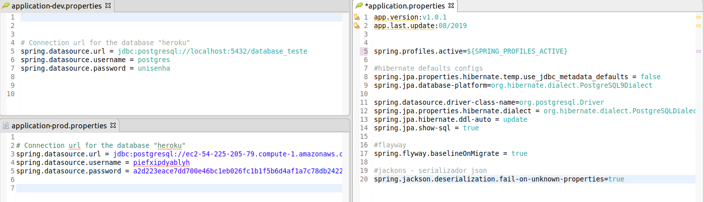
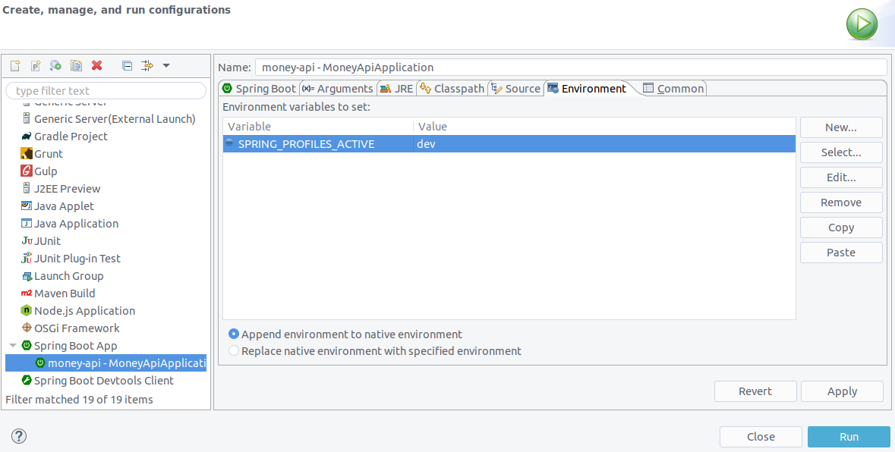

### money-api

[](https://travis-ci.com/Uniliva/money-api)

Projeto criado a partir do curso de fullstack Angular e Spring da Algaworks


#### Tecnologias
- Spring boot
- Spring Data
- Postgree
- Flyway


----

### Configurando o ambiente de desenvolvimento

- Banco postgres local 

link: https://www.saltycrane.com/blog/2019/01/how-run-postgresql-docker-mac-local-development/

```shell
docker run -d --name <name-container> -v my_dbdata:/var/lib/postgresql/data -p 5432:5432 postgres
```
- Criando senha para o usuario **postgres**

```shell
docker exec -it  <name-container> psql -U postgres -c "ALTER USER postgres WITH PASSWORD 'unisenha'"
```
- criando banco de dados
- 

```plsql
docker exec -it  <name-container> psql -U postgres -c "create database database_teste 	with owner = postgres encoding = 'UTF8'"
```

- Conectando via dbeaver


---

### Executando projeto

- Instale as dependencias

```shell
mvn install
```

- importe no eclipse


-- crie profiles

Caso queira passar o profile que o spring deve sergui via variavel de ambiente
- Crie uma variavel de ambiente ex  `export SPRING_PROFILES_ACTIVE=dev` e use conforme abaixo

spring.profiles.active={SPRING_PROFILES_ACTIVE}




#### Maldito eclipse

O eclipse, pelo que vi, não reconhece as variaveis de ambiente, para executar usando variaveis de ambiente use nas configurações de execução a aba environment para configurar a variavel




