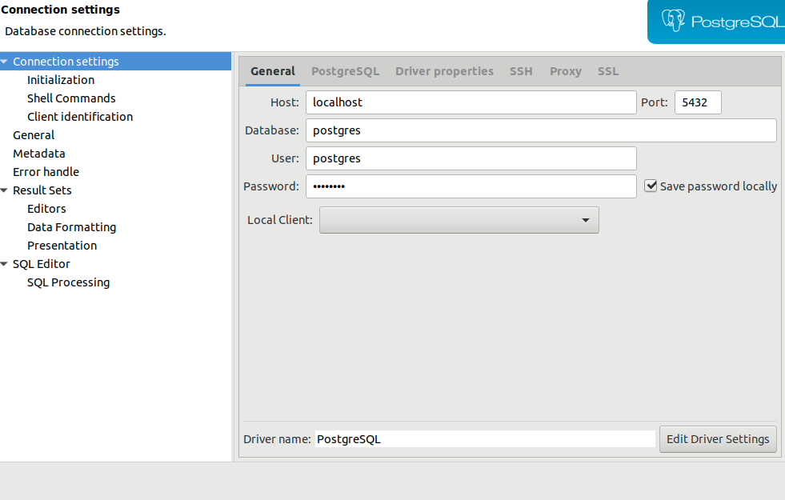

### Configurando o ambiente

- Banco postgres local 

link: https://www.saltycrane.com/blog/2019/01/how-run-postgresql-docker-mac-local-development/

```shell
docker run -d --name <name-container> -v my_dbdata:/var/lib/postgresql/data -p 5432:5432 postgres
```
- Criando senha para o usuario **postgres**

```shell
docker exec -it  <name-container> psql -U postgres -c "ALTER USER postgres WITH PASSWORD 'unisenha'"
```
- criando banco de dados
- 

```plsql
docker exec -it  <name-container> psql -U postgres -c "create database database_teste 	with owner = postgres encoding = 'UTF8'"
```

- Conectando via dbeaver


